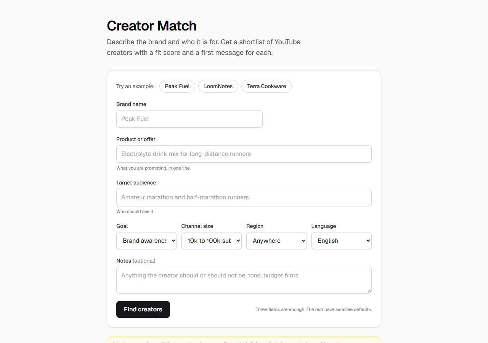

# Creator Match

Creator Match turns a short brand brief into a ranked shortlist of YouTube creators, each with a fit score, the reasons behind it, and a ready-to-send first message. It runs entirely on free tiers: the Gemini API writes the search queries and scores the channels, the public YouTube Data API supplies the channels and their stats, and Upstash Redis caches everything so repeated briefs cost nothing. It was built in about eight hours of working sessions with Claude Code, planned before any code was written, and every step was tested and verified on the live site before the next one started.

**Live:** https://creator-match-seven.vercel.app



## How it works

1. **Brief.** You enter the brand name, the product, and the audience. Goal, channel size, region, and language are dropdowns with defaults. Three example briefs fill the form in one tap.
2. **Queries.** Gemini turns the brief into three searches a viewer would actually type, from three angles: the core topic, the audience's lifestyle, and an adjacent interest.
3. **Search.** Each query runs against YouTube's video search, and the channels behind the results are aggregated. A channel that appears for more than one query ranks higher.
4. **Stats and ranking.** Channel stats arrive in one call. Channels outside the chosen size range, with hidden subscriber counts, or with almost no videos are dropped, and the rest are ranked by how many queries matched, recency, and region.
5. **Scores.** Gemini scores the top ten against the brief in batches of five, streaming each batch to the page as it lands: a 0 to 100 fit score, two to four reasons grounded in the channel data, concerns, who actually watches, and an outreach draft with a subject line and opening message you can copy.

A fresh brief takes under 10 seconds. A brief that has been seen before, and each of the three examples, takes under a second.

## Engineering decisions

- **Cache first, everywhere.** Briefs, searches, and scores live in Redis for 7 days, keyed by a hash of the normalized brief, so the same brief with different capitalisation or spacing hits the same entry. YouTube searches are cached per query and channel stats per channel. A cached result never costs quota or counts against anyone's limit.
- **Quotas are the real constraint.** YouTube allows 100 searches a day and the Gemini free tier allows 500 requests a day. The app counts both in Redis, keyed by the Pacific date the quotas reset on, and refuses before spending rather than after a 429. Scoring is batched so a fresh brief costs 3 YouTube searches and 3 Gemini requests, not 11.
- **Open page, per-visitor limits.** There is no sign-up. Each visitor, identified by a salted hash of their IP, gets 3 live searches and 10 new briefs a day. Limits are checked before any external call and only charged when something was actually spent.
- **A passcode for demos.** An optional passcode, stored as an HMAC in an HttpOnly cookie, lifts the per-visitor limits for the owner. The global quota still applies at a higher threshold, so a leaked cookie cannot exhaust it.
- **Precomputed examples.** The three example briefs are run once by a script and committed as JSON. A read-through layer in front of the cache serves them, so they work in under a second with zero quota, even when every budget is spent.
- **Swappable LLM provider.** One module defines the provider interface; one file imports the Gemini SDK. The prompts, schemas, parsing, budgets, routes, and tests sit above that boundary. Switching providers is one new file. The app started on the Claude API and moved to Gemini for cost before the first LLM call was written.
- **Streamed scores.** The score route returns newline-delimited JSON, one line per channel, so cards fill in as each batch finishes instead of waiting for the slowest one.

## Built with Claude Code

Claude Code did the planning, implementation, debugging, testing, and refactoring, with a human deciding the direction at each step. `BUILD_LOG.md` is the full record, one entry per step with what was built, how it was verified locally and on the live URL, timings, and what went wrong.

- **Planning.** The first deliverables were `PLAN.md` (Zod data model, routes, components, risks, and a build order of small runnable steps) and `CLAUDE.md` (conventions and commands), written after a round of questions and after checking the live documentation for the SDKs, model names, Vercel limits, and the YouTube quota model, which turned out to have changed.
- **Implementation.** Twelve steps, each ending in something that runs. The repo went to GitHub and Vercel after the first step, so every later step was checked on the production URL.
- **Debugging.** Finding the production domain by changing the page title, discovering that an env file edit wipes the dev server's cache, and catching thirty tests that silently started passing through precomputed data are the stories worth reading in the log.
- **Testing.** 150 tests with Vitest. Route handlers are called directly with `Request` objects; the Gemini SDK and the YouTube client are mocked, so the suite never spends quota. Each route has happy-path, limit, and failure cases.
- **Refactoring.** The move from the Claude API to the Gemini free tier was done as a documented plan change before step 6: docs updated and reviewed first, code changed after.

## Run it locally

Requirements: Node 20 or newer, a Gemini API key from Google AI Studio, and a YouTube Data API v3 key from Google Cloud.

```bash
npm install
cp .env.example .env.local   # fill in GEMINI_API_KEY and YOUTUBE_API_KEY
npm run dev                  # http://localhost:3000
```

Without Redis variables the cache is in memory, which is fine for local use. The checks:

```bash
npm run lint && npm run typecheck && npm test
```

To regenerate the example briefs after changing the prompts or schemas (about 9 searches and 9 Gemini requests):

```bash
npm run precompute
```

Deployed on Vercel with Upstash Redis added from the Marketplace, which injects the two `KV_REST_API_*` variables. Set the same API keys there. An optional `DEMO_PASSCODE` enables the owner bypass.

## Limits

| Limit                     | Value                                 | Why                                        |
| ------------------------- | ------------------------------------- | ------------------------------------------ |
| Live searches per visitor | 3 a day                               | YouTube allows 100 searches a day in total |
| New briefs per visitor    | 10 a day                              | Each one is a Gemini request               |
| Creators scored per brief | 10                                    | Latency and the daily Gemini cap           |
| Global YouTube searches   | 60 a day public, 95 with the passcode | Headroom below the 100 cap                 |
| Global Gemini requests    | 450 a day                             | Headroom below the 500 cap                 |

Cached briefs and the three examples are always free.

## What is next

- Engagement signal: fetch view counts for the matched videos (one extra unit) and show views per video next to subscriber counts.
- Share links: a `?b=` parameter that reopens a cached result.
- Export: CSV of the shortlist with scores and outreach drafts.
- Smarter ranking once scores exist, since with three queries few channels match more than two of them.

## Stack

Next.js 16 (App Router), TypeScript, Tailwind v4, Zod, Google Gen AI SDK (Gemini 3.5 Flash-Lite), YouTube Data API v3, Upstash Redis, Vitest. Deployed on Vercel.
